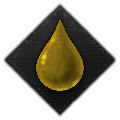
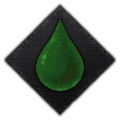
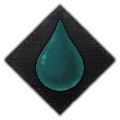
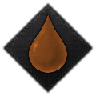

---
tags:
  - CK3
  - Bloodlines
---

# Bloodlines

Long before the elves were scattered, six great houses shaped their own lineages
through millennia of careful breeding. Their descendants survive across the world,
and each still carries a **bloodline trait** — a hereditary gift, always paired with
a matching curse.

## The six great houses

| House | | Hallmark | Gift | Curse |
|---|---|---|---|---|
| **Valerith** |  | Silver hair, ethereal beauty | Breeding for the flesh lets them coil other lords around their fingers — masters of charm and seduction. | A total lack of self-control; they grow addicted to indulgence and fall to the very seductions they practise. |
| **Serelion** |  | Piercing purple eyes | Pragmatic cruelty and the dread they inspire give them firm control of their lands. | Their terrified troops are seldom loyal and fight poorly on the battlefield. |
| **Gwynthorn** |  | Industrious, obsessively diligent | Relentless caretakers of their realms — tireless stewards of their lands. | Their fixation on duty stresses many Gwynthorns into an early grave. |
| **Thundarael** |  | Pale skin, brilliant, manic | Bred as spark-wielders — many of the mightiest Magi come from this house; they move fast and learn at an astounding rate. | Madness runs in the blood; many are driven to insanity by their own power. |
| **Daelurin** |  | Gargantuan size, martial might | Formidable warriors of giant stature — the "giants" of old legend were likely Daelurin. | Generations bred for battle left them slow of mind and sluggish of movement. |
| **Lormelis** |  | Ocean-blue eyes, sea-bound | Captivating and fierce — unmatched raiders, ambitious to reclaim the lost glory of Atlantis. | Single-minded and inflexible, blind to changing tides, prone to strife within and without. |

Each bloodline maps to one of the six elven [house cultures](cultures-religion.md#elven-cultures)
of the same name.

## Inheriting a bloodline

Bloodline traits are **physical genetic traits**. A child of a parent who carries one
has roughly an even chance of inheriting it — and if **both** parents share the same
bloodline, the child inherits it for certain.

That simple rule drives much of elven society. To strengthen a bloodline you must
pair like with like, which is why elven nobility is so preoccupied with marriage and
why the [Aeluran Matchmaking](decisions-activities.md#activities) activity exists:
the Order's Red Sisters curate spouses precisely to breed prized bloodlines back
into a dynasty.

## Bloodlines and the Aeluran Order

The Aeluran Order prizes bloodline purity, and it shows in the
[Aeluran Regency](government-diarchies.md#the-aeluran-regency): a character who
carries one of the six bloodlines earns the Order's **respect**. Cultivating pure
lineages, then, is not only a path to stronger heirs — it is a way to keep the
sisterhood favourably disposed toward your rule.

## See also

- [Bloodlines & Dynasties](../lore/bloodlines-and-dynasties.md) — the full lore of the six houses.
- [Genetics & Heredity](../lore/genetics-and-traits.md) — how gifts, curses, and blood purity are inherited.
- [Decisions & Activities](decisions-activities.md) — the Aeluran Matchmaking activity.
