---
tags:
  - CK3
  - Cultures
  - Religion
---

# Cultures & Religion

Elf Destiny rebuilds CK3's culture and faith systems around the elves: a set of
elven cultures, a tradition system where much of your culture must be *discovered*,
and the Aeluran faith that binds elven society together.

## Elven cultures

Every elf shares the **Elf heritage** and speaks **High Elven**. Within that, the mod
adds six named elven cultures, each descended from one of the great ancient houses
and each with its own ethos and starting traditions:

| Culture | Ethos | Flavour |
|---|---|---|
| **Daelurin** | Bellicose | A warrior people — merit in arms, a warrior culture. |
| **Serelion** | Bellicose | Heirs of a Roman-style legacy and its republican traditions. |
| **Gwynthorn** | Egalitarian | A Celtic-flavoured folk of runestones and strong kinship. |
| **Thundarael** | Spiritual | Seekers of learning and sorcerous metallurgy. |
| **Valerith** | Courtly | Welcoming and beguiling — charm as a way of life. |
| **Lormelis** | Courtly | A culture of chivalry and the sword. |

A generic Elf culture also exists for elves outside the great houses.

## Cultural traditions — the discovery system

The mod's signature culture mechanic is **discovery**. Many elven traditions are
*Lost Traditions* — they are not available to adopt by default. You uncover them by
exploring ancient ruins on [expeditions](expeditions.md), and only once a tradition
has been discovered can your culture take it on. (Try to adopt one you haven't found
and the game tells you plainly: *"You haven't discovered this tradition yet... Try
going on an Expedition!"*)

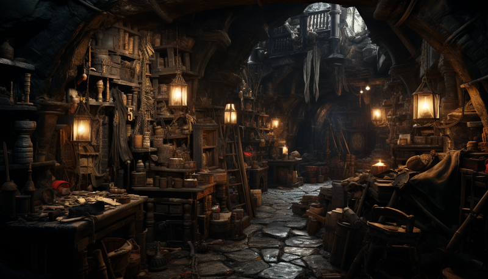

### The elven traditions

| | Tradition | What it does |
|---|---|---|
| 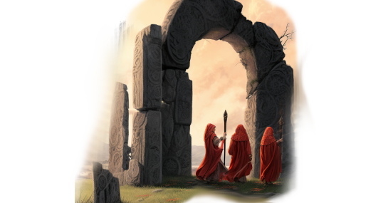{ width="48" } | **The Old Ways** | An ancient culture that looks to the past for wisdom. Unlocks **Fey Archers** men-at-arms. |
| 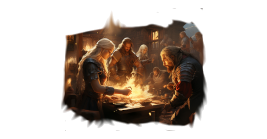{ width="48" } | **Elven Craftsmanship** | Renowned artisans whose works are sought across the world. |
| 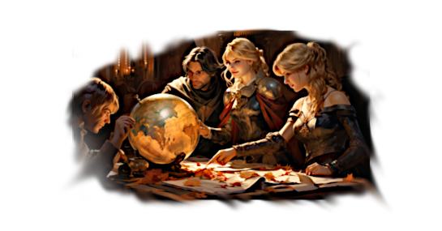{ width="48" } | **Adventurer Guilds** | Guilds that sponsor explorers — expeditions cost less gold and grant more adventurer experience, parties may face two Trials per expedition, and the *Varangian Adventure* casus belli is unlocked in the Tribal era. |
| 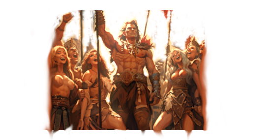{ width="48" } | **Tribal Ascension** | Lets rulers adopt the [Ascended Tribal](government-diarchies.md#ascended-tribal) government, and unlocks the **Warband Ravagers** and **Warband Vanguard** men-at-arms. |
| 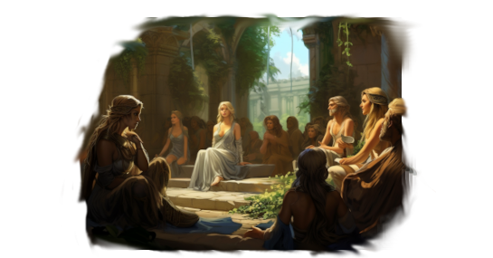{ width="48" } | **Fey Agoras** | A culture of philosophers and scholars — characters gain *Shrewd* at 15 Learning and the second level at 20. |
| 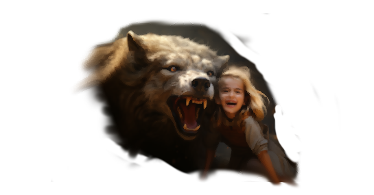{ width="48" } | **Beast Tamers** | Breeders of loyal beasts — unlocks **Wolf Riders** and **Mosswood Dragoons** men-at-arms, characters adopt pets more often, and magically talented pet-owners can gain the *Warg* trait. |
| 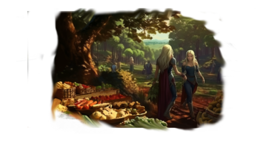{ width="48" } | **Woodland Bounty** | A woodland people who can build farms in forest and taiga provinces. |
| 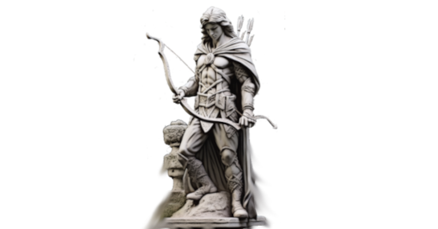{ width="48" } | **People of the Bow** | Archery as the measure of excellence — elves gain a Bow trait level on coming of age, and the **Ranger High Guard** men-at-arms are unlocked. |
|  | **Fey Tribes of the North** | A regional tradition of the northern "Forest People" — hunters, river-fishers, smelters, and herders. |
| 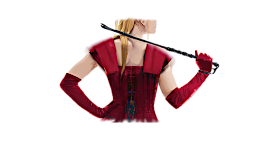{ width="48" } | **Aeluran Etiquette** | A culture under the Aeluran Order's sway — religious and cultural county conversion are both 33% faster. |

## The path toward humans

Two of the elven traditions form a defining, mutually exclusive choice — how elves
should regard the humans they live among:

- **Open Hearted** — *"Humans... Elves... we are all children of the Divine Spark."*
  Humans will accept marriage with elves of this culture regardless of their
  religion. A road of harmony and integration.
- **Elven Superiority** — *"It is the destiny of elves to direct the fate of the
  realm's peoples."* Hybridising with humans becomes costlier, but elven rulers gain
  a modifier granting monthly renown and prestige.

A culture cannot hold both — committing to one closes the door on the other.

## Blessings

**Blessings** are a special category of tradition, set apart from the rest. They are
not discovered on expeditions — they are *granted* by religious events, gifts of the
Divine Spark itself. They look distinct from ordinary traditions and cannot be
hybridised away.

| | Blessing | What it does |
|---|---|---|
| 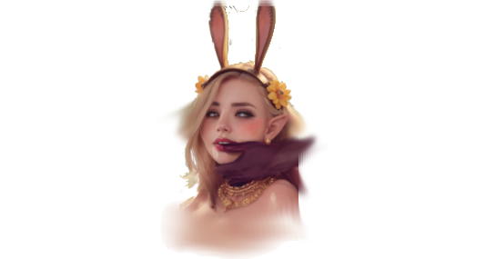{ width="48" } | **The Rut** | Roughly once a decade a great heat overtakes the culture's young, who gain the *Lustful* trait until it passes — and multiple births become far more common. |
| 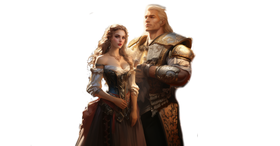{ width="48" } | **Noble Husbandry** | Generations of careful eugenics unlock the highest genetic potential — elves can become top-tier *Beauty*, *Intellect*, and *Physique* characters. |
| 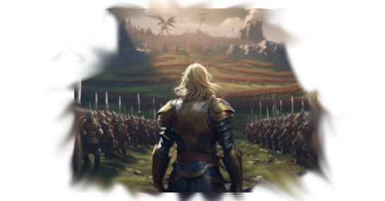{ width="48" } | **Heroic Courage** | A furious fire in the people's hearts — characters gain *Brave* after slaying 2 enemies in battle and *Heroic* after 5. |
| 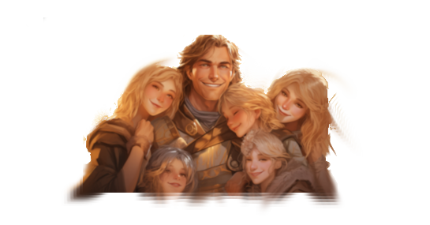{ width="48" } | **Familial Familiarity** | The Spark removes all marriage taboos — elves may wed within their own families. Children may be born *Purer Blooded*, and the children of paired twins may be *Purest Blooded*. |
| 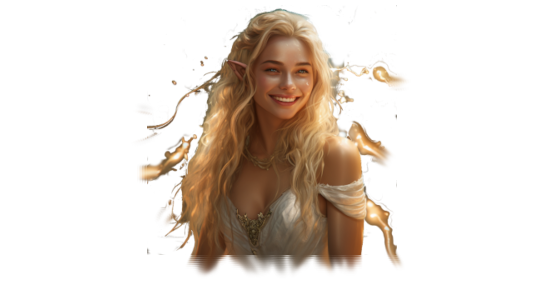{ width="48" } | **Beguiling Nature** | An effortless magical charm — unlocks the **Entrance** scheme, the path to the *Enchantress* trait, and the use of Intrigue together with Diplomacy in a Battle of Wills. |
| 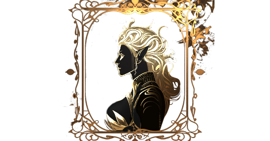{ width="48" } | **Blessing of Vána** | *Gift of Many Mothers* — the goddess of fertility blesses the culture to birth six girls for every boy. |
| 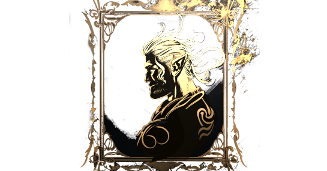{ width="48" } | **Blessing of Tulkas Astaldo** | *Gift of Endless Armies* — the god of war blesses the culture to birth six boys for every girl. |

## The Aeluran faith

The elven religion is the **Aeluran faith**, the worship of the Divine Spark as kept
by the Aeluran sisterhood. A few things set it apart from CK3's ordinary faiths:

- **A female clergy.** Only women may serve as clergy — the faith's spiritual power
  rests in its sisters.
- **Its tenets** centre on the Aeluran Sisters themselves, Divine Marriage, the
  Sanctity of Nature, and a strong Communal Identity.
- **Bloodline over taboo.** Consanguinity is unrestricted — close marriage is no sin
  when the purity of an elven bloodline is at stake — and witchcraft is held to be
  *virtuous*, not criminal.
- **Holy sites are ruins.** The faith's holy sites are the ancient elven ruins
  themselves — Valfuria, the Grand Portal, the Library of Alexandria, and dozens
  more — the very places you visit on [expeditions](expeditions.md).

## Ascension and the faith

Climbing the elven [Ascension tiers](elf-races-traits.md) is an act of faith.
Ascension rituals are performed through the Aeluran religion and paid for with
religious devotion, which is why an elven ruler's spiritual standing matters as much
as their armies.

## See also

- [Elven Cultures](../lore/elven-cultures.md) — the lore of the six cultures.
- [The Aeluran Religion & Order](../lore/aeluran-religion-and-order.md) — the faith's deeper story.
- [Decisions & Activities](decisions-activities.md) — the rituals that perform Ascension and Blessings.
- [EU5 — Pops & Cultures](../eu5/pops-cultures.md) — cultures in the EU5 mod.
