# Elf Races & Traits

Becoming an elf is the turning point of every Elf Destiny campaign. This page covers
what elfhood actually does for a character, the tiers an elf can climb, and the
notable traits the mod adds.

## What it means to be an elf

An elf is not simply a human with pointed ears. Once a character is transformed,
their whole nature changes:

- **Pointed ears** — a genetic feature that passes (partially) to descendants, so
  children may be born with full, half, or no elf ears.
- **An ageless look** — elves stop visibly aging in adulthood; their portrait is
  frozen at a youthful "immortal age".
- **A long life** — every elf tier adds to life expectancy, and from the Elf tier
  upward an elf no longer loses prowess to old age.
- **Sharper gifts** — elfhood grants bonuses to learning, prowess, and how
  attractive others find them. These bonuses grow with every Ascension tier.

## The Ascension tiers

Elfhood is layered. A character belongs to one **tier**, and through Ascension can
climb toward god-like power. The mod recognises twelve elf tiers above ordinary
humans:

| | Group | Tiers |
|---|---|---|
| 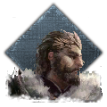 | *(Human — tier 0)* | Not an elf; severed from the Divine Spark |
| 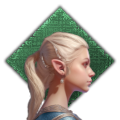 | **Common Elf** | Elf Blood · Elf · High Elf |
| 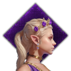 | **Fae** | True Elf · Fae · Fae Radiant |
| 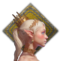 | **Celestial** | Celestial · Seraphic Celestial · Eldar |
| 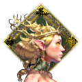 | **Ainur** | Maiar · Valar · Aratar |

Each step up increases an elf's stat bonuses and lifespan; the highest tiers are
effectively divine. The last tier of each group — **High Elf**, **Fae Radiant**, and
**Eldar** — is a *threshold*, the peak of that group and the gateway into the next.

!!! note "Eldar vs. Vanyar"
    The CK3 mod calls the ninth tier **Eldar**. The Europa Universalis V version
    calls the same tier *Vanyar* — a naming difference between the two mods.

How a character actually rises through these tiers — the genetic lottery and the
Ascension ritual — is part of the faith and culture systems, covered on their own
pages.

## Immortality

Immortality in Elf Destiny is tied to tier, not inherited directly. An elf becomes
immortal on reaching adulthood and stops aging; as a lower-tier elf nears the end of
a long life, they return to mortality. From the **Celestial** tier upward, that no
longer happens — high elves are truly, permanently immortal.

## Notable traits

Beyond the tier itself, the mod adds traits an elf character can pick up:

| | Trait | What it does |
|---|---|---|
| 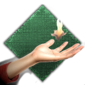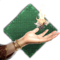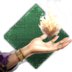 | **Magic Talent** (I–III) | A genetic trait marking a knack for the Spark — boosts learning and lifestyle experience. Higher levels are stronger, and a level here is the groundwork for becoming a Magi. |
| 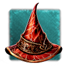 | **Magi** | A wielder of the Spark — the mod's upgraded "miracle worker". Grants prowess. In the lore, true Spark-weaving is the domain of women. |
| 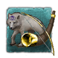 | **Warg** | A bond with beasts — grants martial and intrigue, resistance to hostile schemes, dread, and the ability to send animals as spies. |
| 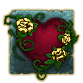 | **Enchantress** | A master of allure — boosts intrigue and attraction, and lets the character *entrance* others. |
| 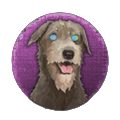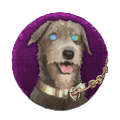 | **Entranced / Enthralled** | Status traits placed on a character who has fallen under an Enchantress's sway. They sap learning and lifestyle growth; *Enthralled* is the deeper, stronger hold. |

## Bloodlines

Scattered across the world are the descendants of the six great ancient elf
dynasties — Valerith, Serelion, Gwynthorn, Thundarael, Daelurin, and Lormelis. Each
carries a hereditary **bloodline trait**: a distinct gift paired with a matching
curse. Breeding these prized bloodlines back into your own line is a central pursuit
of elven nobility.

The six houses get a page of their own — see [Bloodlines](bloodlines.md).
