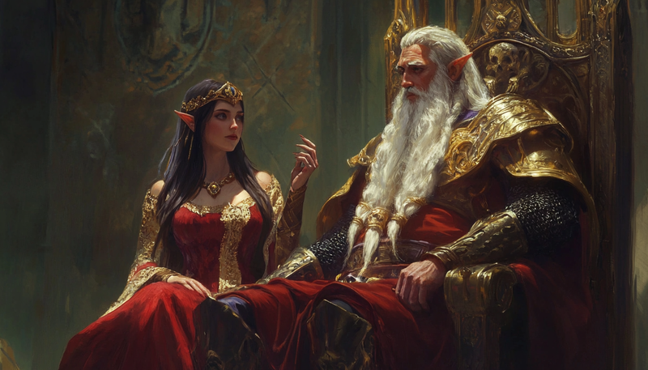
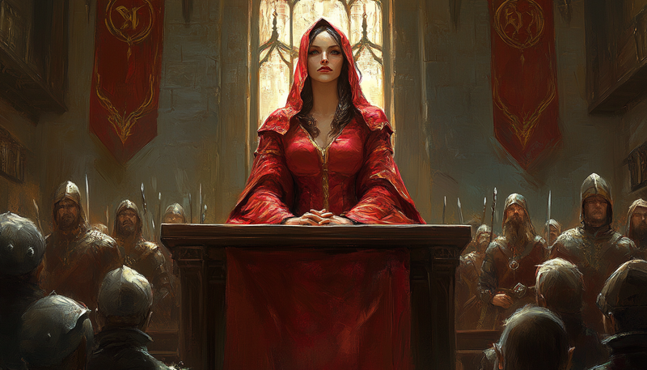

# Government & Diarchies

An elven realm is not governed like a human kingdom. Its defining feature is the
realm's relationship with the Aeluran order — a ladder of laws that decides how much
power the sisterhood holds over you, and, if you let it go far enough, a
power-sharing **diarchy**. The mod also adds its own elven government type,
**Ascended Tribal**.

## Aeluran Realm Authority

How much the Aeluran sisterhood is woven into your government is decided by a law
line, **Aeluran Realm Authority**. You climb it one rung at a time, each step paid
for in piety and prestige:

| Law | What it means |
|---|---|
| **Secular Government** | The default. The order holds no formal power. Passing this law again later *dissolves* an existing regency. |
| **Aeluran Realm Authority I** | The order gains a foothold — your religious advisor is replaced by a far more capable **Aeluran Advisor**, and an Aeluran army answers to your realm. |
| **Institutionalized Authority (II)** | The order is now part of the state. This is the law that **begins the Aeluran Regency** (see below), and brings piety bonuses and a stronger Aeluran army. |
| **Aeluran Judiciary (III)** | The order takes over justice — reduced tyranny, more piety and legitimacy, and the strongest Aeluran army. |

??? example "Law illustrations"
    **Aeluran Realm Authority I**

    

    **Institutionalized Authority (II)**

    

    **Aeluran Judiciary (III)**

    

The trade is deliberate: every rung makes the order more useful *and* more powerful
within your realm. Going secular again is always possible, but it ends the
partnership entirely.

## The Aeluran Regency

Once you pass **Institutionalized Authority**, your Aeluran Advisor becomes your
**diarch** — a co-ruler in a power-sharing arrangement called the Aeluran Regency.

The heart of it is a **balance of power** that drifts over time, sliding between two
poles:

- **Respect** — you hold the upper hand. The order serves loyally and stays in its
  lane.
- **Aeluran Domination** — the order holds the upper hand, in escalating steps.

The design bargain: **Aeluran advisors and vassals are stronger than ordinary ones —
as long as you can keep control.** As the balance tips toward Domination, you unlock
perks like improved vassal and magi contracts, but the sisters also begin to act on
their own initiative — meddling in your succession, replacing your councillors and
court positions, swaying elections, and eyeing counties and whole duchies for the
order. Keep the balance near Respect and you stay firmly in charge, at the cost of
some of those perks.

You can also assign the regent a **mandate** — *Realm Supervision*, *Realm
Subjugation*, or *Realm Domination* — directing how the order applies itself to
running your realm.

## Succession — Elven Elective

Elven realms can pass their titles through an **Elven Elective** succession. Voting
strength is weighted by a character's title tier and military weight, much like
feudal elective — but with an elven twist: the **regent** carries extra weight, and
**Aeluran Order vassals gain more votes the more power the order holds** over your
realm. Letting the sisterhood dominate, in other words, also lets them shape who
inherits.

The mod also adjusts partition and title-succession laws to fit elven realms.

## Ascended Tribal

Becoming an elf does **not** hand you a special government. The mod's elven
government, **Ascended Tribal**, is something you have to *discover*.

It is unlocked by the **Tribal Ascension** cultural tradition — one of the Lost
Traditions recovered from ancient elf ruins on expedition. Which traditions a given
expedition turns up is down to luck, so finding Tribal Ascension is never
guaranteed; you may have to keep exploring for it. Once your culture adopts
the tradition, you — and your AI vassals — convert to Ascended Tribal.

Ascended Tribal is built to be the best of both worlds, a tribe that has *risen*
without becoming feudal:

- **It keeps the tribal strengths** — raiding, building and hiring men-at-arms with
  prestige instead of gold, extra casus belli, and no stunted county development.
- **It gains the feudal strengths** — crown authority, cadet branches, changeable
  succession laws, and the ability to advance past Tribal-era innovations.
- **It builds further** — two extra levels on all tribal buildings, and the ability
  to found new tribal holdings.
- **It musters unique troops** — the tradition also unlocks the **Warband Ravagers**
  and **Warband Vanguard** men-at-arms.

The government itself carries quality-of-life bonuses too: halved title-creation
cost, halved army maintenance, bonus travel safety, and a steady trickle of
prestige.

There is also a separate **Aeluran Order** government, used by rulers of the Aeluran
sisterhood itself. It is built around church holdings and can even be played
landless, reflecting the order's nature as a faith rather than a territory.
