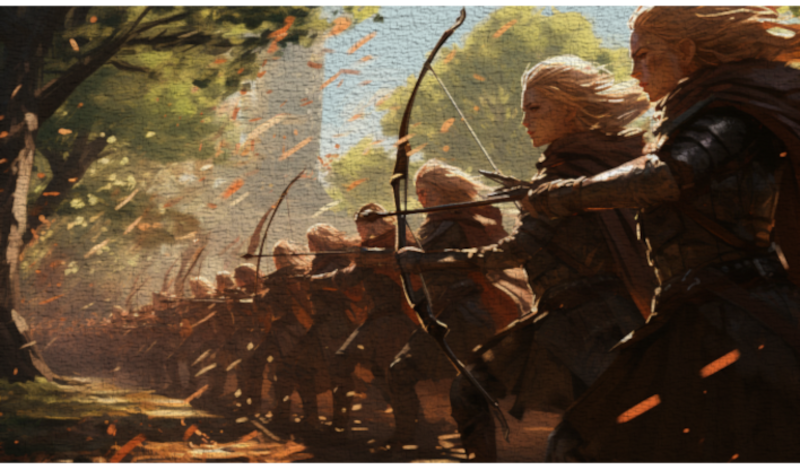
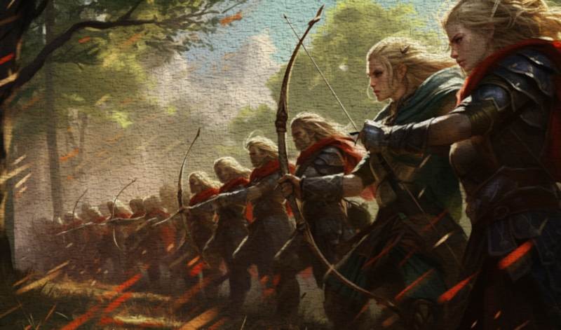
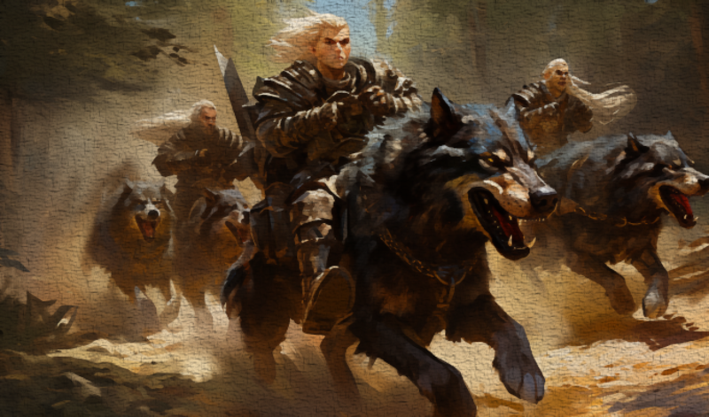
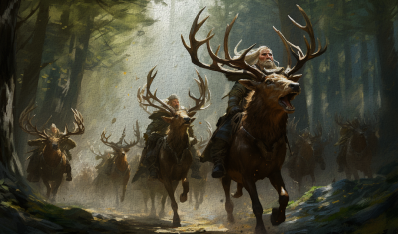
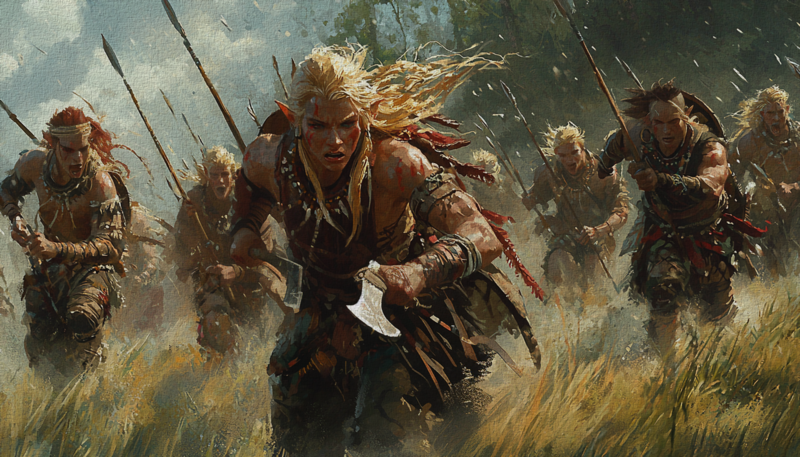
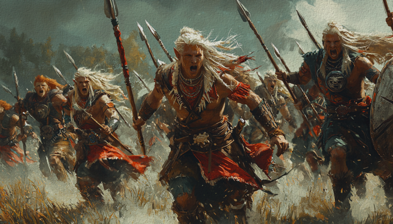
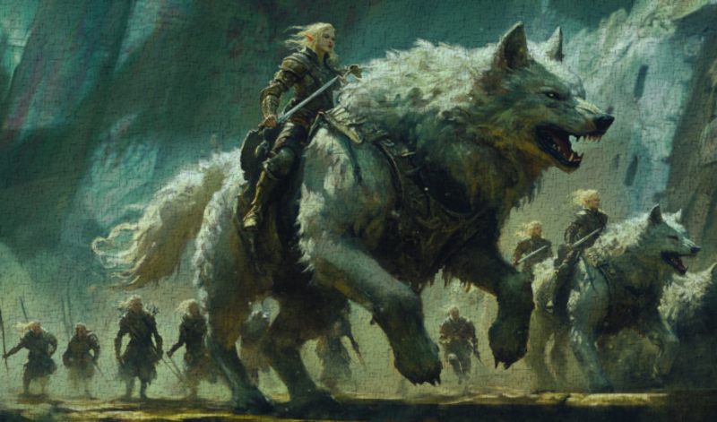
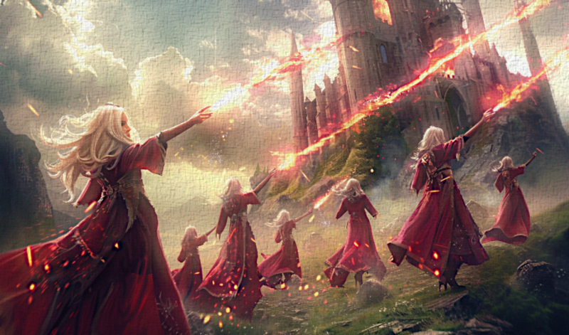
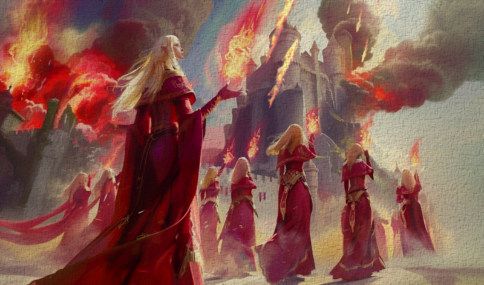

# Units & Warfare

Elf Destiny gives elven realms their own roster of men-at-arms — most of them
unlocked through [cultural traditions](cultures-religion.md#the-elven-traditions) —
and a brand-new troop type for the Magi of the Aeluran Order.

## Elven men-at-arms

These regiments are recruited once your culture or government has the right unlock.
Most are tied to a tradition discovered on [expeditions](expeditions.md):

| Regiment | Type | Unlocked by | Role |
|---|---|---|---|
| **Fey Archers** | Archers | *The Old Ways* tradition | A solid backbone of bowmen, deadly from cover. |
| **Ranger High Guard** | Archers | *People of the Bow* tradition | Hard-hitting, well-armoured archers that counter heavy infantry and cavalry alike. Also the faith's holy-order fallback troop. |
| **Wolf Riders** | Heavy cavalry | *Beast Tamers* tradition | Fast, hard-charging cavalry mounted on great wolves — superb in forests, poor in the mountains. |
| **Mosswood Dragoons** | Archer cavalry | *Beast Tamers* tradition | Highly mobile mounted archers who harass and pursue. |
| **Warband Ravagers** | Skirmishers | *Ascended Tribal* government | Cheap raiders recruited with **prestige**, at home in the deep woods. |
| **Warband Vanguard** | Pikemen | *Ascended Tribal* government | Prestige-recruited pikes that counter every kind of cavalry. |
| **Direwolf Riders** | Heavy cavalry | *Wolf Lords* dynasty | The elite upgrade to Wolf Riders — fearsomely strong, but recruitable only by a dynasty that has earned the Wolf Lords legacy through the [Tame a Direwolf Pup](decisions-activities.md#personal-decisions) line. |

??? example "Unit illustrations"
    **Fey Archers**

    

    **Ranger High Guard**

    

    **Wolf Riders**

    

    **Mosswood Dragoons**

    

    **Warband Ravagers**

    

    **Warband Vanguard**

    

    **Direwolf Riders**

    

## The Aeluran Magi — Spark Wielders

The mod adds an entirely new troop type, **Spark Wielders** — battle-magi fielded by
the Aeluran Order. They can only be recruited by an Aeluran Sister, Matron, or High
Matriarch, they are **bought with gold but maintained with piety**, and they come in
small elite regiments:

- **Aeluran War Magi** — a devastating glass cannon. Their magic counters *every*
  troop type on the field, but they are fragile and few in number.

    

- **Aeluran Magi Artillery** — Magi who specialise in siege warfare, tearing down
  walls while still countering anything that comes at them.

    

Because they cost piety to keep in the field, a Magi army is sustained by a ruler's
spiritual standing rather than their treasury — another reason the
[Aeluran faith](cultures-religion.md#the-aeluran-faith) sits at the centre of
elven power.

## Fighting like an elf

A few principles run through the whole elven roster:

- **The forest is your ally.** Almost every elven regiment — and the Magi most of
  all — gains strong bonuses in forest, taiga, jungle, and wetlands, and many suffer
  badly in the mountains. Elven armies want to fight in the wild woods.
- **Different wars, different currencies.** Warband troops are raised with
  *prestige*, Aeluran Magi are maintained with *piety*. An elven realm's military
  draws on far more than its gold income.
- **Holy orders ride to war too.** The Aeluran faith's holy orders field elven
  troops of their own — Fey Archers, Ranger High Guard, Wolf Riders, and Mosswood
  Dragoons among them.
