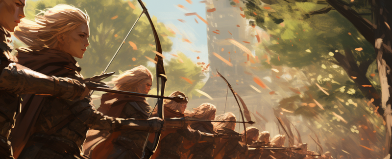
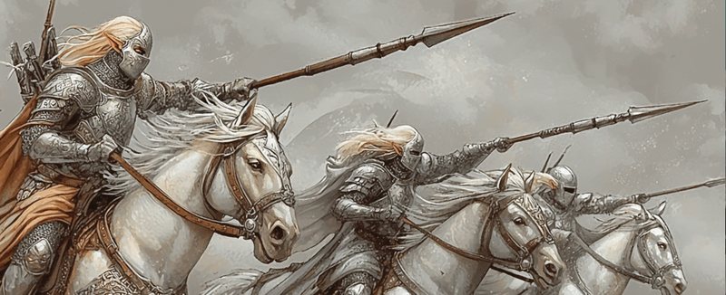
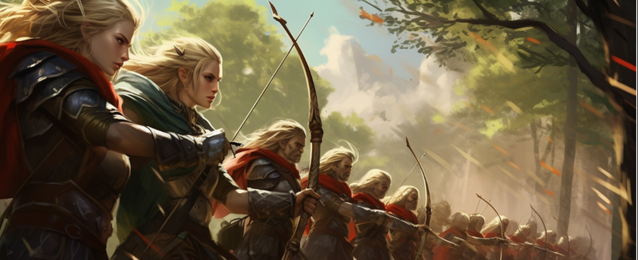
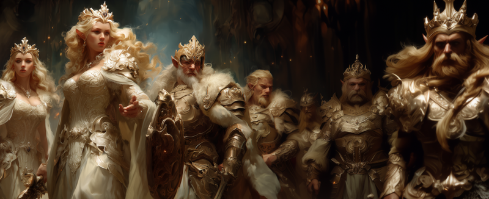
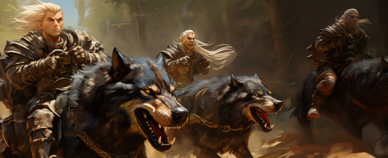
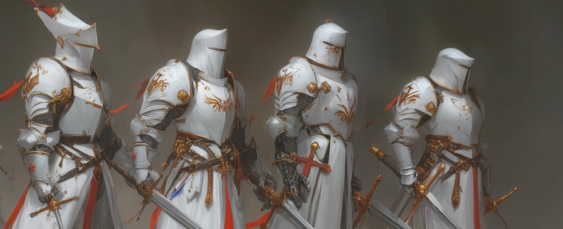
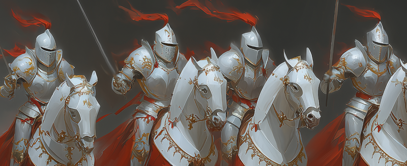

---
tags:
  - EU5
  - Ascension
  - Warfare
---

# Advances, Traits & Units

This page covers the elven institution and its advance tree, the elf racial tiers,
and the military units the mod adds.

## The Elven institution & advance tree

Elf Destiny adds a new institution — **Elven** — which spreads among elven
countries. Embracing it opens an advance tree rooted in a single advance, **Elven
Lore**, which branches four ways:

| Branch | Advances |
|---|---|
| **Crafting** | Elven Artisanship → Mythril Working — unlocks elven workshops, the Lembas Bakery, and Mythril extraction and units. |
| **Nature** | Forest Dominion → Herbal Mastery and Beast Tamers — woodland output, disease resistance, and the Wolf Riders unit. |
| **Magic** | Level 2 Magic → **Grand Portal Restored** → Level 3–6 Magic — each level strengthens magi and unlocks stronger Aeluran Magi levies. |
| **War** | Level 2 War → Level 3 War and Honor of the Fay — military tactics, army tradition, and stronger levies. |

The magic branch is gated on the story: **Grand Portal Restored** sits in the middle
of it, and the highest magic advances also require your ruler to have Ascended to
the Fae or Celestial tiers.

## The elf tiers

An elf character carries a racial trait marking their **tier**. Climbing the tiers
through [Ascension](aeluran-religion.md#the-ascension-ritual) is dramatic — each tier
adds administrative, diplomatic, and military skill, extends lifespan, and
strengthens the crown:

| Tier band | Effect |
|---|---|
| **Tiers 1–3** (Elf Blood → High Elf) | Modest skill bonuses; +15 to +50 years of life. |
| **Tiers 4–6** (True Elf → Fae Radiant) | Strong skill bonuses; lifespans of one to several centuries. |
| **Tiers 7–12** (Celestial → Aratar) | Sweeping skill bonuses — and **true immortality**. |

At the top, an Aratar-tier ruler is effectively a living god, with vast bonuses to
every skill. For the lore of the tiers, see the lore section's
[Elven Ascension](../lore/elven-ascension.md) page.

## Units

The mod adds a roster of elven military units, recruited as levies or units as you
research the advance tree and adopt the right reforms:

| Unit | Notes |
|---|---|
| **Fey Archers** | The backbone elven archer levy, in early and late forms. |
| **Elf Noble Lancers** | Elven noble cavalry. |
| **Ranger High Guard** | Elite archers, unlocked by the *People of the Bow* government reform. |
| **Calaquendi High Magi** | The devastating spellcaster levy raised from the Calaquendi population. |
| **Wolf Riders** | Wolf-mounted cavalry, unlocked by the *Beast Tamers* advance. |
| **Mythril-Plated Fey Vanguard** | Heavy elven infantry in legendary Mythril armour. |
| **Mythril-Plated Horse Masters** | Mythril-armoured elven cavalry. |

??? example "Unit illustrations"
    **Fey Archers**

    

    **Elf Noble Lancers**

    

    **Ranger High Guard**

    

    **Calaquendi High Magi**

    

    **Wolf Riders**

    

    **Mythril-Plated Fey Vanguard**

    

    **Mythril-Plated Horse Masters**

    

The Mythril-plated units, like Mythril coinage, depend on discovering **Mythril
Working** — the lost craft of working the metal *"desired even by the Valar
themselves."*

## See also

- [Elven Ascension](../lore/elven-ascension.md) — the lore of the twelve tiers.
- [The Aeluran Religion & Holy Sites](aeluran-religion.md) — the religious influence that fuels Ascension.
- [The Portal Network](portal-network.md) — the restoration that gates the magic branch.
- [CK3 — Units & Warfare](../ck3/units-warfare.md) — the CK3 mod's elven roster.
