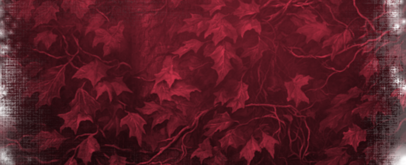

---
tags:
  - EU5
  - Religion
---

# The Aeluran Religion & Holy Sites

All elves worship the **Divine Spark**, and the **Aeluran** faith is the religion
that gives that worship its form. It is shepherded by the Order of the Aeluran
Weavers — the all-female sisterhood known to common folk as the Red Witches.

For the deeper story of the faith and the Order, see the lore section's
[Aeluran Religion & Order](../lore/aeluran-religion-and-order.md) page.

## How the faith works

The Aeluran religion behaves differently from EU5's ordinary faiths:

- It has a **religious head** and runs on **religious influence** — a resource you
  spend on rituals and Ascension.
- It **allows a female cabinet**, fitting for a faith led by a sisterhood.
- It can hold up to **five religious aspects** at once.

## Religious aspects

Religious aspects are Spark-granted facets of a people's faith. The Aeluran faith
has five:

| Aspect | What it grants |
|---|---|
| **The Rut** | A fertility blessing — and unlocks the Shrine to Vána. |
| **Noble Husbandry** | Pushes society toward aristocracy and unlocks the highest tier of genetic traits. |
| **Heroic Courage** | Unlocks the Heroic ruler trait and raises discipline. |
| **Beguiling Nature** | Unlocks the Enchantress ruler trait, makes rare beauty traits more likely, and opens the Fairest Ascendancy estate privilege. |
| **Familial Familiarity** | Unlocks higher pure-blood genetics and pushes society toward aristocracy. |

## Holy sites

The faith's holiest place is the **Grand Portal Ruins**, located at Mezen in the
northern elven heartland. Holding it — and, once it is rebuilt, the
[restored Grand Portal](portal-network.md) — strengthens your religious icons and
your clergy.

## Blessings

With enough religious influence, an elven ruler can perform a ritual to convene with
the Divine Spark and receive a **Blessing** — a powerful boon that falls on the
whole elven population of the country. The Spark works in mysterious ways, and the
effects of a Blessing can be peculiar as often as they are mighty.

## The Ascension ritual

Religious influence also fuels [Ascension](advances-traits-units.md#the-elf-tiers).
From the religion panel, an elf may perform the **Ascension ritual** to climb to a
higher elf tier — each tier costing more influence than the last, which is why
building up your religious influence capacity matters so much.

## The Aeluran Order

The Aeluran Order exists in the game as an **international organisation** — a body
that spans the elven world, led by the realm of Deepwood. It is the institutional
form of the sisterhood that ties the scattered elven realms to a single faith.

## See also

- [The Aeluran Religion & Order](../lore/aeluran-religion-and-order.md) — the lore of the faith and sisterhood.
- [Advances, Traits & Units](advances-traits-units.md) — the Ascension that religious influence fuels.
- [Estates & Privileges](estates-privileges.md) — the Aeluran clergy estate.
- [CK3 — Cultures & Religion](../ck3/cultures-religion.md) — the Aeluran faith in the CK3 mod.
