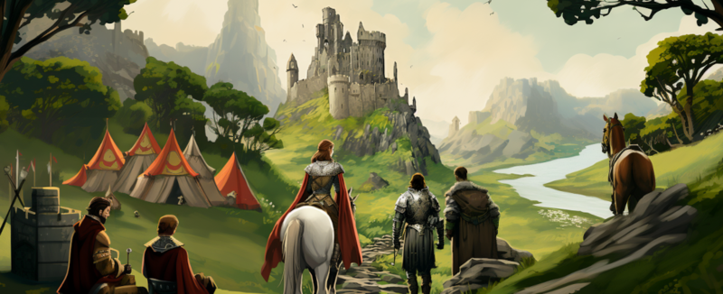

---
tags:
  - EU5
  - Expeditions
---

# Expeditions

Expeditions are how an elven realm rediscovers its lost past — and how it recovers
the components needed to restore the [Grand Portal](portal-network.md).

## The first expedition

Shortly after a campaign begins, an **archaeologist** arrives at your court. She has
found the ruins of the mythical elven people and needs funding to mount an
expedition. Agree, and her successful return hands you a powerful artifact, launches
the quest to restore the elven world, and unlocks the **Fund Expedition** character
interaction for your ruler.

That first expedition is also what gives your characters the chance to be
**transformed into elves**.

## Funding further expeditions

From then on, expeditions become a repeatable part of your reign:

- **Fund Expedition** — your ruler can personally fund an expedition into the
  ancient ruins.
- **Co-sponsor an expedition** — the [Calaquendi estate](estates-privileges.md)
  can bring a parliament agenda to share the cost of an expedition with the crown.

Each expedition plays out through events — discoveries, hazards, and choices — and
can turn up gold, artifacts, lost elven traditions, and most importantly the
**portal components** that the restoration of the Grand Portal depends on.

!!! note "Story content"
    The EU5 mod's story content tracks the CK3 version and grows alongside it.
    A formal mission tree is not yet part of the mod — the expedition questline is
    driven through events and [parliament](parliament.md) issues for now.

## See also

- [The Expedition Storyline](../lore/expedition-storyline.md) — the questline told as lore.
- [The Portal Network](portal-network.md) — what the recovered components rebuild.
- [CK3 — Expeditions](../ck3/expeditions.md) — expeditions in the CK3 mod.
