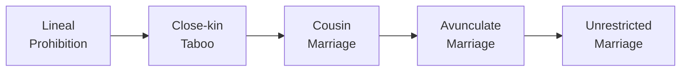

---
tags:
  - EU5
  - Government
---

# Government & Laws

Elf Destiny gives elven realms a set of their own government reforms and reworks
several of EU5's laws to fit elven society.

## Government reforms

Elven countries have access to a set of unique reforms.

### The choice toward humanity

Early in a campaign, a story event forces a defining, **permanent** choice — how
your elven realm will treat the humans it rules. The two reforms are mutually
exclusive, and once chosen, the reform is locked:

- **Elven Superiority** — humans exist to serve. Unlocks slave-raiding and
  raid-for-humans casus belli, with raid efficiency and prestige bonuses, at the
  cost of diplomatic reputation.
- **Open Hearted** — humans and elves are equals. Grants diplomatic reputation,
  reduced cultural antagonism, greater culture capacity, and bonus population growth
  in locations where elves and humans live side by side.

### Other elven reforms

| Reform | Effect |
|---|---|
| **Masters of Woodland Realms** *(major)* | Bonus lumber, fur, and wild game; forest and woodland locations gain food, prosperity, and defensiveness. |
| **People of the Bow** | Stronger, cheaper infantry (at the expense of cavalry), and unlocks the **Ranger High Guard** unit. |
| **The Old Ways** | Bonus magi army power, literacy, and crown estate power. |

## Laws

The mod adds and reworks several laws for elven realms:

- **Elven Marriage** — an elven marriage law reflecting elven polygamy: a ruler may
  take up to four spouses.
- **Mythril coinage** — coin laws that let a realm mint with **Mythril**, the
  legendary elven metal, once Mythril Working has been discovered. The precious
  metal laws are likewise extended to cover Mythril alongside gold and silver.
- **Consanguinity Law** — a law governing how close a marriage elven society
  permits, running through five doctrines:

| Doctrine | Marriage policy |
|---|---|
| Lineal Prohibition | No marriage within the family line at all. |
| Close-kin Taboo | Marrying any relative is a grave offense. |
| Cousin Marriage | First cousins may wed. |
| Avunculate Marriage | Cousins and aunt/uncle–niece/nephew unions are allowed. |
| Unrestricted Marriage | Any family marriage permitted. |

The looser doctrines are favoured by the [Calaquendi](pops-cultures.md#the-calaquendi)
and the crown — a reflection of the elven obsession with pure bloodlines. Adopting
the unrestricted doctrine in an Aeluran realm can even prompt the Divine Spark to
take notice.

## See also

- [Nations & Factions](../lore/nations-and-factions.md) — the lore of the choice toward humanity.
- [Estates & Privileges](estates-privileges.md) and [Parliament](parliament.md) — the rest of elven governance.
- [CK3 — Government & Diarchies](../ck3/government-diarchies.md) — the CK3 mod's elven government.
