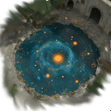
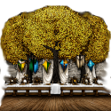
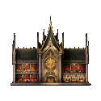

---
tags:
  - EU5
  - Government
---

# Parliament

Elven realms govern through the **Elven Parliament** — and much of the mod's
mid-game, from building the Calaquendi's great works to restoring the Grand Portal,
runs through it.

## The Elven Parliament

Every elven country uses the **Elven Parliament**, a parliamentary system in which
three estates hold seats: the **clergy**, the **burghers**, and — uniquely — the
**[Calaquendi](estates-privileges.md#the-calaquendi-estate)**.

## Calaquendi parliament issues

The Calaquendi estate brings parliament issues that **sponsor great works** — each
one builds a unique Calaquendi building at half cost, and each building raises your
realm's **religious influence**, the resource that fuels Ascension and Blessings:

| | Great work |
|---|---|
| { width="48" } | **Mallorn Tree Grove** |
| { width="48" } | **Baths of Starlight** |
| { width="48" } | **Perfume Garden of Valinor** |
| { width="48" } | **Wine Cellar of Elder Days** |
| { width="48" } | **Feasting Hall of the Trees** |
| { width="48" } | **Grand Archives** |

Steadily passing these issues is how an elven realm builds the religious-influence
capacity it needs to climb the [Ascension](advances-traits-units.md#the-elf-tiers)
ladder.

## Crown parliament issues

The **Crown** brings the two issues that drive the main story forward — **Transport
the Portal** and **Restore the Portal**, the parliamentary steps of the
[Grand Portal](portal-network.md) restoration.

## Parliament agendas

Estates also push **agendas** in parliament. The Calaquendi's agendas include
**co-sponsoring an expedition** — funding an [expedition](expeditions.md) for a share
of the discovery — and steady pushes toward **quality** and **aristocracy**, the
societal values the elven elite favours.

## See also

- [Estates & Privileges](estates-privileges.md) — the three estates that hold parliament seats.
- [The Portal Network](portal-network.md) — the Crown issues that restore the Grand Portal.
- [Government & Laws](government-laws.md) — elven government reforms and laws.
