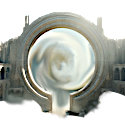
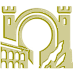
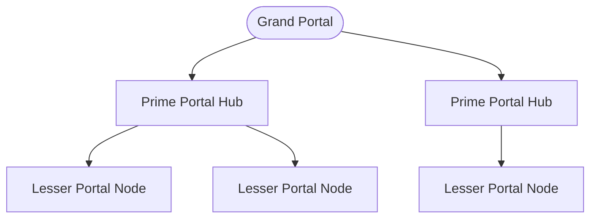

---
tags:
  - EU5
  - Portal
---

# The Portal Network

The restoration of the **Grand Portal** is the central goal of an Elf Destiny
campaign — and once it is whole again, it powers a teleport network across the elven
world.

For the lore of the portal — what it is and where it came from — see the lore
section's [Portal Network](../lore/portal-network.md) page.

## Restoring the Grand Portal

The portal is rebuilt in two steps, both taken through the **Crown** in the
[Elven Parliament](parliament.md):

1. **Transport the Portal** — after you have spoken with the Aeluran Order, the
   ruined Grand Portal is moved from its ancient site to your capital.
2. **Restore the Portal** — once your [expeditions](expeditions.md) have recovered
   the two lost portal components, parliament can pass the restoration, and the
   Grand Portal is made whole.

## What restoration unlocks

Completing the restoration is a turning point for the whole realm. It:

- **Activates the Portal Network** itself (see below).
- **Opens higher Ascension** — elves can now climb into the **Fae tier** and beyond,
  which the broken portal had made impossible.
- **Boosts religious influence**, easing every Ascension that follows.

## The portal network

Once restored, the portal becomes a **situation** on the map — a live network of
linked portal sites. Three buildings make it up:

| | Building | Role |
|---|---|---|
| { width="56" } | **Grand Portal** | The restored portal itself — the heart of the network. |
| { width="56" } | **Prime Portal Hub** | A primary station extending the network. |
| { width="56" } | **Lesser Portal Node** | Secondary connection points built elsewhere in the realm. |

On the map, the network shows which portals are **usable** to you and which are not,
letting an elven realm move across great distances in a way no human power can
match.

## See also

- [The Portal Network](../lore/portal-network.md) — the lore of the Grand Portal.
- [Parliament](parliament.md) — the Crown issues that pass the restoration.
- [Advances, Traits & Units](advances-traits-units.md) — the higher Ascension restoration unlocks.
