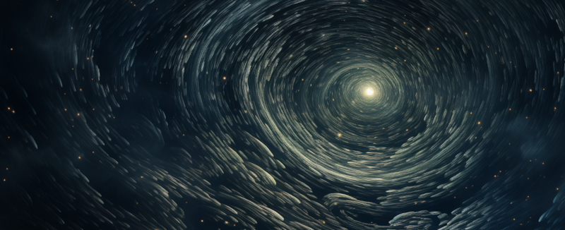

---
tags:
  - Lore
  - Cosmology
---

# The Divine Spark & Cosmology

Behind everything in the world of Elf Destiny stands the **Divine Spark** — the
source of life, the power the elves draw upon, and the reason their world is shaped
the way it is.

## What is the Divine Spark?

The Aeluran faith describes it plainly:

> *The all-powerful source of life energy to the connected worlds. The Divine Spark
> is the source of all life. It gifts great power to the faithful, and the faithful
> reciprocate its gifts through their service. Those who achieve greater attunement
> with the Divine Spark can achieve Ascension and increase their Elven tier. The
> Divine Spark is neither truly good nor evil — it grows more powerful by harvesting
> the lived experience of the life it creates. Both harvesters and nurturers of life
> can be equally favoured, as long as they follow its will. As it grows in power its
> reach expands further into the universe, where it finds new planets to seed with
> life and connect to the Grand Portal network.*

## The truth behind the Spark

For all that the faithful worship it as a god, the Divine Spark was not always one.
At its heart it is **an individual who Ascended so extraordinarily high that they
became a creator god** — the ultimate end of the very Ascension path the elves walk.
The Spark is, in a sense, what waits at the top of the ladder.

Two things follow from this, and both unsettle the simple picture of a benevolent
creator:

- **The Spark is not automatically good.** It favours whoever serves its goal of
  spreading and harvesting life — conqueror and caretaker alike. The Dark Elves
  serve the Divine Spark every bit as much as their gentler kin.
- **The Spark is not alone.** Other Divine Sparks exist, each governing its own
  worlds with its own "life patterns" and its own equivalents of elvenkind. They are
  not allies. They are rivals.

## The connected worlds

The Divine Spark is forever expanding. It **finds new planets**, seeds them with
life, and **connects them into the Grand Portal network** so that life — and the
Spark's reach — can flow between them.

Earth was added to that network at the beginning of history, when the elves and
humans first stepped through the portal. Earth, in other words, is not special: it
is one world among many in a single Divine Spark's domain.

## The Void

Between the connected worlds lies **the Void** — the realm in between realms. It is
a shadowy, half-understood place even in elven lore. Some elves have learned to
reach into it and summon creatures from its depths, a practice bound up with dark
magic.

The Void is also a prison. When an unspeakable evil once ravaged the world, the Elf
Lords of that age could not destroy it — they could only **banish it into the
Void**, using a weapon forged by the legendary smith Celebrim. The Void, then, is
both the space between worlds and the place where the world's worst horrors are
sealed away.

## Rival creator gods

Because other Divine Sparks exist, and because they compete, the restoration of the
Grand Portal is a double-edged triumph. Reopening the gateway reconnects Earth to
the network — but it also reopens the road for others.

!!! note "What the future may hold"
    A restored portal must "mature" before the mightiest beings of other realms can
    pass through it. Rival powers are expected to send their lesser servants ahead
    first, to gain a foothold — and, given enough time, larger incursions may
    follow. Petitioners from powerful factions beyond the portal may also arrive
    seeking favours, offering gifts and boons in return. This is lore that points
    toward the future of the mod rather than the present day.

## The Spark as magic

The magic of the elves is the Divine Spark made usable. Elves channel **Spark** —
the raw life energy the Divine Spark creates — and the tiers of Spark Weaving mark
ever-greater mastery of it. To work magic, to Ascend, to live a long elven life: all
of it is the Spark, flowing through those attuned to it.

This is why Ascension matters so much. To climb the elven tiers is not merely to
grow powerful — it is to draw closer, step by step, to the nature of the Divine
Spark itself.

## See also

- [Elven Ascension](elven-ascension.md) — the ladder that leads toward the Spark.
- [The Valar Pantheon](valar-pantheon.md) — elves who climbed it all the way.
- [The Portal Network](portal-network.md) — how worlds are connected to the Spark.
- [Magic](magic.md) — the Spark made usable.
