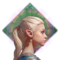
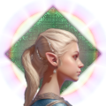
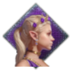
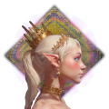
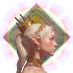

# Elven Ascension

Ascension is the process by which elves evolve into higher forms of being through
ever-deeper attunement with the [Divine Spark](divine-spark-and-cosmology.md). It is
the central thread of elven society and one of the great themes of Elf Destiny.

> *Not all elves are equal — there are tiers to elfhood. Basic elves are only
> slightly more powerful than humans, but as you reach the later tiers you
> essentially become a god.*

## The twelve tiers

Above ordinary humanity, the elves recognise twelve tiers of being:

| Tier | | Name | Meaning |
|---|---|---|---|
| 0 |  | Human | The bottom rung — severed from the Spark, unable to naturally Ascend. |
| 1 |  | Elf Blood | A half-elf hybrid, still eligible for Ascension. |
| 2 |  | Elf | The base elf tier; where most newly transformed characters begin. |
| 3 |  | High Elf | The first true step of Ascension. |
| 4 |  | True Elf | A major gateway — body and soul purified. |
| 5 |  | Fae | A transformative milestone into higher magical alignment. |
| 6 |  | Fae Radiant | Legendary fae of noble grace and tremendous power. |
| 7 |  | Celestial | A divine quality of being; true immortality begins here. |
| 8 |  | Seraphic Celestial | A near-angelic state. |
| 9 |  | Vanyar *(Eldar)* | The pinnacle of common Ascension — the high chosen of the gods. |
| 10 |  | Maia | Demi-god servants of the Valar; the lowest rank of the Ainur. |
| 11 |  | Vala | A mighty god of the Divine Spark. |
| 12 |  | Aratar | The most powerful few among the Valar. |

!!! note "Vanyar or Eldar?"
    The ninth tier is called **Vanyar** in the Europa Universalis V mod and
    **Eldar** in the Crusader Kings III mod — the same tier under two names.

### The three great thresholds

Three points on the ladder are **major thresholds**, each the gateway into a whole
new class of being:

1. **Into the Fae** — having perfected the common elf tiers, an elf rises into the
   ranks of the regal Fae, elves who stand above the common folk.
2. **Into the Celestial** — having perfected the Fae tiers, an elf becomes one of
   the mystical Celestials, angelic and truly immortal.
3. **Into the Ainur** — having perfected the Celestial tiers, an elf joins the
   divine Ainur: gods of the elves and the highest servants of the Divine Spark.

## Godhood is real

The top tiers — Maia, Vala, Aratar — are not a separate, unreachable order of
creation. The [Valar of the pantheon](divine-spark-and-cosmology.md) are simply
elves who Ascended that far. In principle anyone could climb so high; in practice
only the current pantheon ever has. And what can be climbed can also be fallen
from — a god, too, can fall.

## How elves Ascend

There are two paths upward:

- **The genetic lottery.** When two parents of similar tier have a child, there is a
  small chance the child is born a tier higher. This passive path is the reason
  elven cultures are so fixated on bloodlines and careful marriage.
- **The Ascension ritual.** An elf may retreat into meditation and petition the
  Divine Spark directly. If the Spark is receptive, they emerge a higher being. The
  ritual is an act of faith, paid for with religious devotion, and each tier demands
  more than the last.

## Humans and the Spark

Humans are not outside this hierarchy — they are simply **tier 0**. They were once
connected to the Spark but have lost that connection, leaving them unable to wield
it or to Ascend on their own. Only something extraordinary — such as the Sigil of
the Realm Lord — can bridge that gap and lift a human onto the ladder.

## Immortality

Elves are given immortality on reaching adulthood; their appearance freezes at a
youthful "immortal age" while they go on aging in truth. For the lower tiers, that
gift fades again as a long life nears its end, and the elf returns to mortality.
From the **Celestial** tier upward, it never fades — high elves are truly,
permanently immortal.

## Why the portal matters

There is a hard limit on how far an elf can climb. Earth no longer holds enough
latent Spark energy to sustain Ascension beyond the lower tiers — the connection
that once fed it was cut when the [Grand Portal](portal-network.md) was destroyed.

This is why restoring the portal matters so much. Reopening it reconnects Earth to
the Divine Spark's network and lets the Spark flow freely once more — and only then
can the highest reaches of Ascension truly open again.
