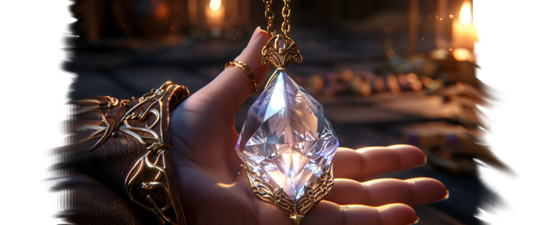

---
tags:
  - Lore
  - Story
  - Expeditions
---

# The Expedition Storyline

The heart of an Elf Destiny campaign is a single unfolding story — the tale of how
an ordinary ruler becomes the Realm Lord and sets out to restore the Grand Portal.
It begins with the arrival of one strange visitor.

!!! warning "This page spoils the main story"
    What follows is the full main questline, told beat by beat. If you would rather
    discover it in play, stop here.

## Julia Melwood

**Julia Melwood** is the spark that lights the whole story — a young human
archaeologist who has devoted herself to the study of the lost elven civilisation.
She is brilliant in her field and endearingly awkward out of it, and she arrives at
court with a map she cannot read and a request she will not drop.

## The story

??? note "1 — The arrival"
    Your steward brings word of an odd woman seeking an audience — one Julia
    Melwood, who *"claims to be a trained archaeologist"* and whom the steward is
    *"fairly sure made that title up"*, all while she knocks over a vase. She says
    she has made a discovery concerning the elves. To most of the court, the elves
    are *"nothing more than children's fairy tales"* — but she is insistent.

??? note "2 — The proposal"
    Julia lays out a parchment bordered in undecipherable elven script. It marks,
    she believes, the **fortress-tomb of the Last Elf Emperor** — a place that may
    still hold treasures lost to time. She has the map but not the means, and asks
    you to fund an expedition. Refuse, and the story ends before it begins.

??? note "3 — The discovery"
    Julia returns in triumph: the ruins were real, the tomb of an ancient elven
    emperor. Among the treasures she opens a small chest holding a **radiant
    amulet** — a crystal glowing with unknown power. You feel a pull toward it that
    you cannot resist.

??? note "4 — A powerful presence"
    The moment you touch the gem, a blinding light swallows you and Julia, and you
    sense you are *not alone*. A vast, incomprehensible presence examines every fibre
    of your being — comforting and terrifying at once. This is your first contact
    with the [Divine Spark](divine-spark-and-cosmology.md).

??? note "5 — The transformation"
    The presence fills your mind with visions of how the great elves once lived. You
    choose whether to embrace elven culture entirely or forge a new elven people of
    your own — and then the light fades. Your ears have lengthened. So have Julia's.
    *You have been transformed into elves.* You are now the **Realm Lord**.

??? note "6 — A choice of dreams"
    In sleep, the presence returns. It shows you thousands of lifetimes — wars
    between humans and elves, empires built on human slaves, and grand feasts shared
    between human and elf kings alike — and presses a single command into your mind:
    **Choose.** Here you set your stance toward humanity: dominion, or harmony.

??? note "7 — The Red Witches"
    The **High Matriarch** of the Aeluran Order comes in person to meet the new
    Realm Lord. She tells you the truth of the [world's history](world-history.md) —
    the portal, the rebellion, the Great Exodus — and names your task: *"It is time
    to restore the Grand Portal and welcome the elven people back to this world."*
    To do it, you must keep mounting expeditions to recover the portal's lost
    components. *"The world's fate lies in your hands. I do not say that lightly."*

??? note "8 — Restoring the portal"
    The long work of gathering the portal's components and rebuilding it is told in
    full on the [Portal Network](portal-network.md) page. When it is done:

    > *After many trials and great personal cost the Grand Portal is finally
    > restored! ... You are a true Realm Lord now. The time of Elves comes again!*

## Treasures of the expeditions

The expeditions turn up more than portal parts. Chief among the finds is the
**Sigil of the Realm Lord** itself — the radiant amulet of the Last Emperor — along
with the portal's **Spark Capacitor** and **Navigation Relay**, and curiosities like
the **Mysterious Elixir**, whose effect is never the same twice.

One discovery, the knowledge of working *Mythril*, carries the mod's single passing
mention of **dwarves** — *"More common among Dwarves, but where is one going to find
one of them these days?"* It is a throwaway line, and dwarves appear nowhere else;
make of it what you will.

## How it plays in each game

=== "Crusader Kings III"

    The story unfolds through a chain of [story events](../ck3/story-events.md),
    while [expeditions](../ck3/expeditions.md) are run as an **activity** — you fund
    a party, set out for the ruins, and work through their trials and treasures.

=== "Europa Universalis V"

    The first expedition is what **transforms your characters into elves**.
    Afterwards, expeditions run through the **Fund Expedition** interaction and a
    chain of events rather than a mission tree.

    [:octicons-arrow-right-24: EU5 — Expeditions](../eu5/expeditions.md)
